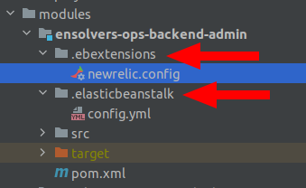

# New Relic integration in AWS Elastic Beanstalk

- Copy [newrelic.config](../templates/elasticbeanstalk/newrelic.config) file to `.ebextensions` folder inside your Elastic BeanStalk application (this folder has to be in the same folder as `.elasticbeanstalk`)

- In the file you copied, replace `<YOUR_NR_LICENSE_KEY>` with your new relic license key

- Set the name of your application as you'd like it to show up in New Relic setting the environment variable `NRIA_DISPLAY_NAME` (under **software configuration** in aws console -> elastic beanstalk). For example: QA-BACKEND

- Deploy a new version of your app and check new relic console.